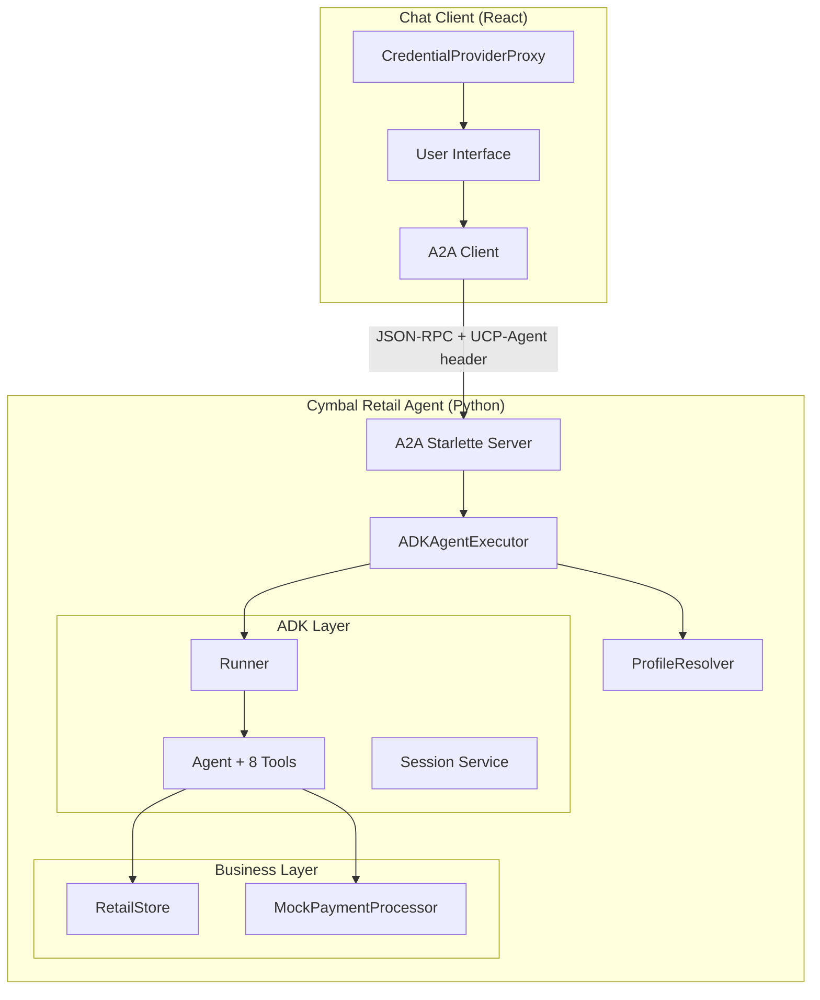
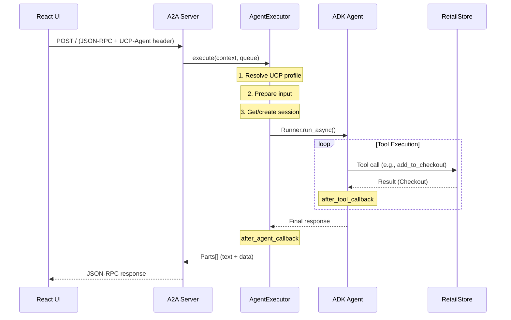
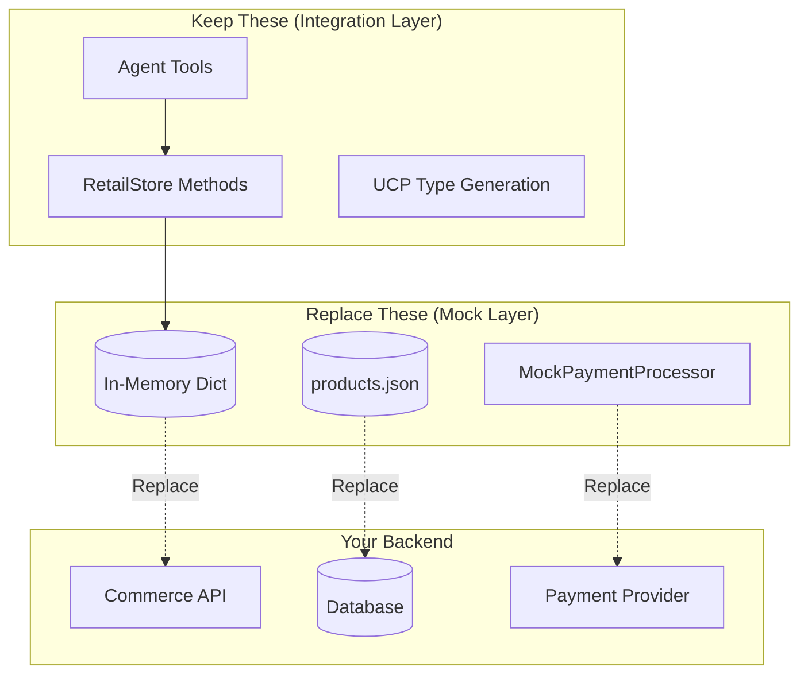

# System Architecture

## TL;DR

- **4 layers**: A2A Server → Agent Executor → ADK Agent → Retail Store
- **2 protocols**: A2A (agent communication) + UCP (commerce data)
- **Request flow**: JSON-RPC → ADK Runner → Tool execution → Response

## System Overview



## Components

### Backend

| Component | File | Responsibility |
|-----------|------|----------------|
| A2A Server | `main.py` | HTTP server, routing, static files |
| Agent Executor | `agent_executor.py` | Bridge A2A ↔ ADK, session management |
| Profile Resolver | `ucp_profile_resolver.py` | UCP capability negotiation |
| ADK Agent | `agent.py` | LLM reasoning, tool execution |
| Retail Store | `store.py` | Products, checkouts, orders |
| Payment Processor | `payment_processor.py` | Mock payment handling |

### Frontend

| Component | File | Responsibility |
|-----------|------|----------------|
| App | `App.tsx` | State management, A2A messaging |
| ChatMessage | `components/ChatMessage.tsx` | Message rendering |
| Checkout | `components/Checkout.tsx` | Checkout display |
| ProductCard | `components/ProductCard.tsx` | Product cards |
| PaymentMethodSelector | `components/PaymentMethodSelector.tsx` | Payment selection |

## Request Flow



## Layer Responsibilities

| Layer | Input | Output | Key Class |
|-------|-------|--------|-----------|
| **A2A Server** | HTTP request | HTTP response | `A2AStarletteApplication` |
| **Agent Executor** | A2A context | Event queue | `ADKAgentExecutor` |
| **ADK Agent** | User query + state | Tool results | `Agent` (google.adk) |
| **Retail Store** | Method calls | Domain objects | `RetailStore` |

## Mock Store Architecture

### Why a Mock Store?

The sample uses an in-memory mock store (`store.py`) to demonstrate UCP integration without requiring a real commerce backend. This lets you:

- **Run standalone** - Zero external dependencies (no database, no API keys beyond Gemini)
- **Learn the patterns** - Understand UCP/ADK integration before connecting real systems
- **Prototype quickly** - Test new features without backend complexity

### Store Structure



| Storage | Type | Purpose |
|---------|------|---------|
| `_products` | `dict[str, Product]` | Product catalog (loaded from `products.json`) |
| `_checkouts` | `dict[str, Checkout]` | Active shopping sessions |
| `_orders` | `dict[str, Checkout]` | Completed orders |

### Key Methods

| Method | Line | Called By | Purpose |
|--------|------|-----------|---------|
| `search_products()` | 100 | `search_shopping_catalog` tool | Keyword search in catalog |
| `add_to_checkout()` | 186 | `add_to_checkout` tool | Create/update checkout session |
| `get_checkout()` | 244 | `get_checkout` tool | Retrieve current checkout state |
| `start_payment()` | 463 | `start_payment` tool | Validate checkout for payment |
| `place_order()` | 498 | `complete_checkout` tool | Finalize order, generate confirmation |

### Replacing with Real Backend

To connect a real commerce platform (Shopify, Magento, custom API):

**1. Create interface** (recommended for clean separation):

```python
# interfaces.py
from abc import ABC, abstractmethod

class IRetailStore(ABC):
    @abstractmethod
    def search_products(self, query: str) -> ProductResults: ...

    @abstractmethod
    def add_to_checkout(self, checkout_id: str | None, product_id: str,
                        quantity: int, ucp_metadata: UcpMetadata) -> Checkout: ...

    @abstractmethod
    def get_checkout(self, checkout_id: str) -> Checkout | None: ...
```

**2. Implement adapter** for your platform:

```python
# shopify_store.py
class ShopifyStore(IRetailStore):
    def __init__(self, api_key: str, store_url: str):
        self.client = ShopifyClient(api_key, store_url)

    def search_products(self, query: str) -> ProductResults:
        shopify_products = self.client.products.search(query)
        # Convert to UCP ProductResults format
        return ProductResults(results=[...])
```

**3. Swap in agent.py** (line 43):

```python
# Before
store = RetailStore()

# After
store = ShopifyStore(
    api_key=os.getenv("SHOPIFY_API_KEY"),
    store_url=os.getenv("SHOPIFY_STORE_URL")
)
```

### What to Keep vs Replace

| Keep (UCP Patterns) | Replace (Mock Specifics) |
|---------------------|--------------------------|
| Tool function signatures | Data storage layer |
| State management via ToolContext | Product catalog source |
| Checkout type generation | Tax/shipping calculation |
| Response formatting with UCP keys | Payment processing |
| A2A/ADK bridging | Order persistence |

## Discovery Endpoints

| Endpoint | Purpose | Source |
|----------|---------|--------|
| `/.well-known/agent-card.json` | A2A agent capabilities | `data/agent_card.json` |
| `/.well-known/ucp` | UCP merchant profile | `data/ucp.json` |
| `/images/*` | Product images | `data/images/` |
