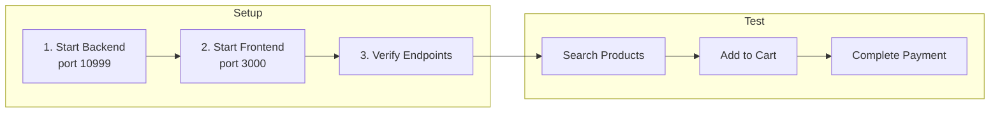
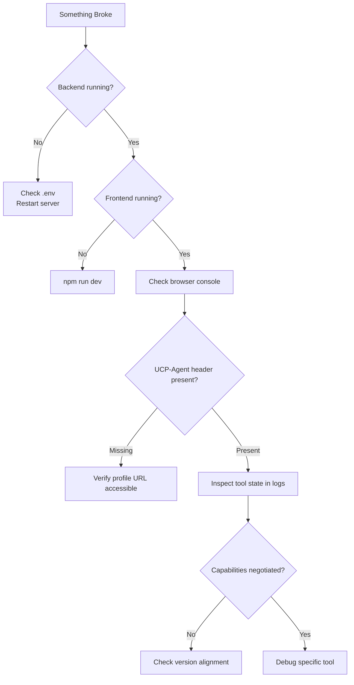

# Testing & Development Guide

## TL;DR

- Start backend (port 10999), then frontend (port 3000)
- Happy path: search → add to cart → checkout → pay
- Debug with verbose logging and endpoint verification

## Setup Flow



## Quick Start

### 1. Start Backend

```bash
cd a2a/business_agent
uv sync
cp env.example .env          # Add GOOGLE_API_KEY
uv run business_agent        # Starts on :10999
```

### 2. Start Frontend

```bash
cd a2a/chat-client
npm install
npm run dev                  # Starts on :3000
```

### 3. Verify Endpoints

```bash
# Agent card (A2A discovery)
curl -s http://localhost:10999/.well-known/agent-card.json | jq .

# UCP profile (merchant capabilities)
curl -s http://localhost:10999/.well-known/ucp | jq .

# Client profile (client capabilities)
curl -s http://localhost:3000/profile/agent_profile.json | jq .
```

## Testing Workflows

### Happy Path (Complete Purchase)

1. Open http://localhost:3000
2. Type "show me cookies"
3. Click "Add to Checkout" on a product
4. Enter email when prompted: `test@example.com`
5. Enter address: `123 Main St, San Francisco, CA 94105`
6. Click "Complete Payment"
7. Select a payment method
8. Click "Confirm Purchase"
9. Verify order confirmation appears with order ID and permalink

**Expected State Transitions**:
- After step 3: `status: "incomplete"`
- After step 5: `status: "incomplete"` (ready for payment start)
- After step 6: `status: "ready_for_complete"`
- After step 8: `status: "completed"`

### Error Scenarios

| Scenario | How to Test | Expected Behavior |
|----------|-------------|-------------------|
| No checkout exists | Call `get_checkout` without adding items | "Checkout not created" error |
| Missing address | Skip address, call `start_payment` | Agent prompts for address |
| Missing email | Skip email, call `start_payment` | Agent prompts for email |
| Invalid product | `add_to_checkout("INVALID-ID", 1)` | "Product not found" error |
| Quantity update | Add item, then `update_checkout` with qty=0 | Item removed from checkout |

## Debugging Guide

### Debug Strategy

When something breaks, follow this systematic approach:



### Enable Verbose Logging

```python
# main.py - add at top
import logging
logging.basicConfig(level=logging.DEBUG)
```

### Inspect Tool State

```python
# In any tool - add temporarily for debugging
def my_tool(tool_context: ToolContext, param: str) -> dict:
    print("=== DEBUG ===")
    print("State keys:", list(tool_context.state.keys()))
    print("Checkout ID:", tool_context.state.get(ADK_USER_CHECKOUT_ID))
    print("UCP Metadata:", tool_context.state.get(ADK_UCP_METADATA_STATE))
    # ... rest of tool
```

### Check A2A Messages

```typescript
// App.tsx - in handleSendMessage, add before fetch
console.log("Request:", JSON.stringify(request, null, 2));

// After response
console.log("Response:", JSON.stringify(data, null, 2));
```

### Test A2A Directly (bypass UI)

```bash
curl -X POST http://localhost:10999/ \
  -H "Content-Type: application/json" \
  -H "UCP-Agent: profile=\"http://localhost:3000/profile/agent_profile.json\"" \
  -d '{
    "jsonrpc": "2.0",
    "id": "1",
    "method": "message/send",
    "params": {
      "message": {
        "role": "user",
        "parts": [{"type": "text", "text": "show me products"}]
      }
    }
  }'
```

## Common Issues

| Issue | Likely Cause | Fix |
|-------|--------------|-----|
| Server won't start | Missing `GOOGLE_API_KEY` | Add key to `.env` file |
| "Profile fetch failed" | Frontend not running | Start chat-client on :3000 |
| "Version unsupported" | Profile version mismatch | Align `version` in both `ucp.json` and `agent_profile.json` |
| "Checkout not found" | Session expired or no items | Call `add_to_checkout` first |
| UI not updating | Missing contextId | Check `contextId` in response, ensure it's passed to next request |
| "Missing UCP metadata" | Header not sent | Verify `UCP-Agent` header in request |
| Payment methods empty | CredentialProviderProxy issue | Check browser console for mock provider errors |

## Reference

### Ports & URLs

| Service | Port | Endpoints |
|---------|------|-----------|
| Backend | 10999 | `/` (A2A), `/.well-known/agent-card.json`, `/.well-known/ucp` |
| Frontend | 3000 | `/`, `/profile/agent_profile.json` |

### Environment Variables

| Variable | Required | Purpose |
|----------|----------|---------|
| `GOOGLE_API_KEY` | Yes | Gemini API access for LLM |

### Key Files for Debugging

| Symptom | Check This File | What to Look For |
|---------|-----------------|------------------|
| Tool not called | `agent.py` | Tool in `tools=[]` list |
| State issues | `constants.py` | State key names |
| Checkout errors | `store.py` | State machine logic |
| UCP negotiation | `ucp_profile_resolver.py` | Version/capability matching |
| Frontend errors | `App.tsx` | Request/response handling |
