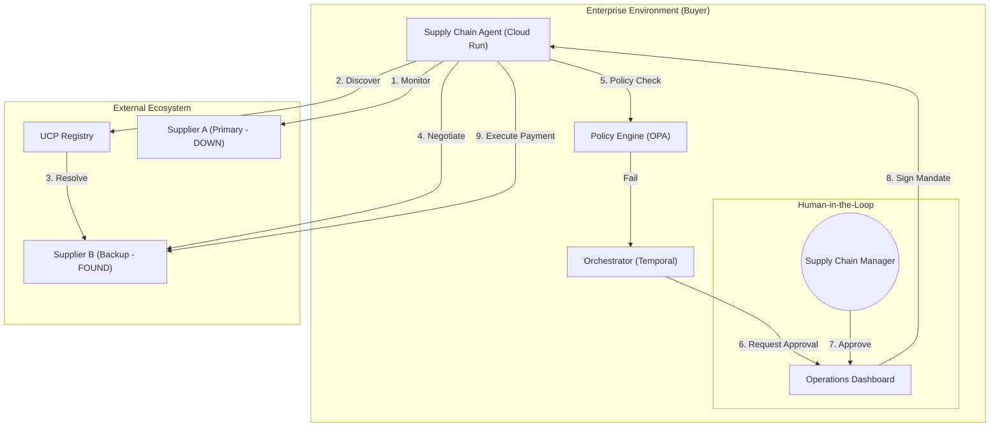

# Self-Healing Supply Chain Demo (UCP & AP2)

This project demonstrates an **Autonomous Supply Chain Agent** capable of "Self-Healing" when a primary supplier fails. It leverages two key next-generation protocols:

*   **UCP (Universal Commerce Protocol)**: For dynamic supplier discovery, checking inventory, and negotiating standardized checkout sessions.
*   **AP2 (Agent Payments Protocol)**: For secure, policy-driven transaction governance and "Agentic Payments".

## 🚀 Scenario

1.  **Monitoring**: The Buyer Agent checks "Supplier A" for "Industrial Widget X". Supplier A is **Offline (503)**.
2.  **Discovery (UCP)**: The Agent queries its network and discovers "Supplier B" (running locally on port 8000).
3.  **Governance (AP2)**: The Agent compares the new price (£550) against the standard (£400).
    *   **Total Cost**: £55,000.
    *   **Variance**: +37.5%.
    *   **Policy Check**: The Corporate Spending Policy (`mock_db.py`) limits auto-approval to £1,000 or <15% variance.
    *   **Result**: The Agent pauses and requests **Human Sign-off** (Human-in-the-loop).
4.  **Execution**: Once approved, the Agent constructs a cryptographically signed **AP2 Payment Mandate**, enables the UCP Checkout, and finalizes the order.

## 🛠️ Setup & Installation

### Prerequisites
*   Python 3.12+
*   Google GenAI API Key

### 1. Environment Configuration
Create a `.env.local` file in the root directory:
```bash
GOOGLE_API_KEY=your_api_key_here
```

### 2. Install Dependencies
```bash
pip install fastapi uvicorn requests python-dotenv
# Note: google-adk, ucp-sdk, ap2-sdk are currently mocked or included in this demo structure.
```

## 🏃‍♂️ How to Run

You will need **two separate terminal windows**.

### Terminal 1: The Backup Supplier (Server)
Start the mock supplier server. This represents "Supplier B".
```bash
python supplier_server.py
```
*Output: `🏭 [SUPPLIER] Server Online at http://0.0.0.0:8000`*

### Terminal 2: The Buyer Agent (Client)
Run the agent.
```bash
python buyer_agent.py
```
*Follow the on-screen prompts. When the policy check fails, press `Enter` to grant admin approval.*

## 🏭 Production Architecture

In a real-world enterprise environment, this architecture scales from local scripts to distributed cloud services.



### Key Differences in Production
1.  **Decentralized Discovery**: Instead of a hardcoded `mock_db.py`, the Agent queries a **UCP Registry** or DID Resolver to find verified suppliers dynamically.
2.  **Cryptographic Trust**: AP2 Mandates are signed with real enterprise Keys (KMS/Vault), providing non-repudiable proof of intent.
3.  **Governance Dashboard**: The `input()` prompt is replaced by a secure **Operations Dashboard** or Slack/Mobile push notification for one-click approval.
