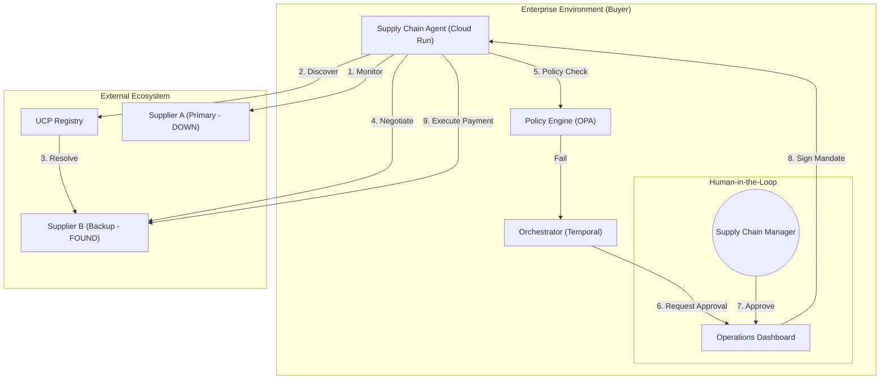

# Self-Healing Supply Chain Demo (UCP & AP2)

This project demonstrates an **Autonomous Supply Chain Agent** capable of "Self-Healing" when a primary supplier fails. It leverages two key next-generation protocols:

*   **Google ADK (Agent Development Kit)**: For orchestrating the autonomous agent, managing state, and integrating with Gemini 3 Flash.
*   **UCP (Universal Commerce Protocol)**: For dynamic supplier discovery, checking inventory, and negotiating standardized checkout sessions.
*   **AP2 (Agent Payments Protocol)**: For secure, policy-driven transaction governance and "Agentic Payments".

## 🚀 Scenario

1.  **Start State**: The demo begins in an **Interactive Mode** with 100 units of inventory. You simulate sales manually.
2.  **Trigger**: When inventory drops below the critical threshold (20 units), the **Autonomous Agent** wakes up to restock.
3.  **Discovery (UCP)**: The Agent detects the primary supplier is down (503) and dynamically discovers "Supplier B" via `/.well-known/ucp`.
4.  **Negotiation (UCP)**:
    *   **Initial Intent**: Agent requests 100 units.
    *   **Counter-Offer**: Server returns "Incomplete" status (needs Address).
    *   **Refinement**: Agent provides Shipping Address + Discount Code (`PARTNER_20`).
    *   **Final Offer**: Server calculates Tax + Shipping - Discount and returns a **Binding Total**.
5.  **Governance (AP2)**: The Agent compares the *Final* price against the standard.
    *   **Variance**: High variance detected (>15%).
    *   **Policy Check**: The Corporate Spending Policy (`mock_db.py`) pauses for **Human Sign-off**.
6.  **Execution**: Once approved, the Agent signs a verifiable **AP2 Payment Mandate** for the *exact* final amount and completes the order.

## 🛠️ Setup & Installation

### Prerequisites
*   Python 3.12+
*   Google GenAI API Key

### 1. Environment Configuration
Create a `.env.local` file in the root directory:
```bash
GOOGLE_API_KEY=your_api_key_here
```

### 2. Install Dependencies
```bash
pip install fastapi uvicorn requests python-dotenv
# Note: google-adk, ucp-sdk, ap2-sdk are currently mocked or included in this demo structure.
```

## 🏃‍♂️ How to Run

The easiest way to run the demo is using the provided start script, which launches both the supplier server and the interactive buyer agent concurrently:

```bash
./start_demo.sh
```

*(Alternatively, you can run `python supplier_server.py` and `python buyer_agent.py` in two separate terminal windows).*

*   **Interactive Loop**: The agent will display current inventory (e.g., `100`).

#### Scenario A: Normal Operation (Safe Zone)
If Inventory is **> 20 units**:
1.  Enter a number (e.g., `50`) to simulate sales.
2.  The Agent will simply update the inventory count.

#### Scenario B: The Crisis (Critical Zone)
If Inventory drops **<= 20 units** (e.g., enter `85` when you have 100):
1.  **Autonomous Trigger**: The "Self-Healing" protocol activates immediately.
2.  **Visual Feedback**: You will see the Agent:
    *   Detect Primary Supplier Failure.
    *   Discover Backup Supplier (Port 8000).
    *   **Negotiate Price**: Adding Shipping/Tax and applying Discounts.
3.  **Governance Check**: The Agent detects the price variance is too high.
4.  **Your Input**: You will be prompted to Approve/Deny the transaction.
    *   *Input:* Press `Enter` to Approve.
5.  **Success**: The Agent signs the AP2 Mandate, restocks inventory, and the loop continues.

#### Scenario C: Total Supply Chain Failure
If you run the agent *without* the supplier server running (`python buyer_agent.py` standalone), the agent will:
1. Detect Primary Supplier Failure.
2. Attempt to resolve Backup Suppliers, but fail (Connection Refused).
3. The restock safety mechanism will trigger, actively failing the operation and preventing artificial inventory inflation.

## 🧠 Agent Architecture (Google ADK)

The Buyer Agent is built using the **Google Agent Development Kit (ADK)**, utilizing a modular "Brain + Tools" pattern:

*   **Model**: Uses `gemini-3-flash-preview` for high-speed reasoning and decision making.
*   **Tools**: Encapsulates specific capabilities as Python functions (`discover_backup_suppliers`, `execute_ucp_transaction`).
*   **Runner**: The ADK `Runner` handles the event loop, routing user inputs (sales data) or system triggers (low inventory) to the model, which then decides which Tool to call.
*   **State**: Uses `InMemorySessionService` to maintain context across the multi-step recovery flow.

## � Best Practices Alignment

This demo adheres to the official **Google Developers UCP & AP2 Architecture**:

1.  **Dynamic Discovery**: Endpoints are never hardcoded. The Agent resolves capabilities dynamically via `/.well-known/ucp`.
2.  **Service-Based Architecture**: Separation of concerns between UCP (Commerce) and AP2 (Trust).
3.  **Verifiable Intent**: Utilizes cryptographic **AP2 Mandates** (Detached JWS) to anchor every transaction to a signed user intent.
4.  **Standardized Schemas**: Uses official `ucp-sdk` Pydantic models generated from the canonical JSON Schemas.

## �🏭 Production Architecture

In a real-world enterprise environment, this architecture scales from local scripts to distributed cloud services.



### Key Differences in Production
1.  **Decentralized Discovery**: Instead of a hardcoded `mock_db.py`, the Agent queries a **UCP Registry** or DID Resolver to find verified suppliers dynamically.
2.  **Cryptographic Trust**: AP2 Mandates are signed with real enterprise Keys (KMS/Vault), providing non-repudiable proof of intent.
3.  **Governance Dashboard**: The `input()` prompt is replaced by a secure **Operations Dashboard** or Slack/Mobile push notification for one-click approval.
